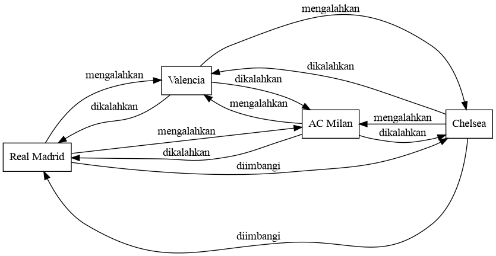
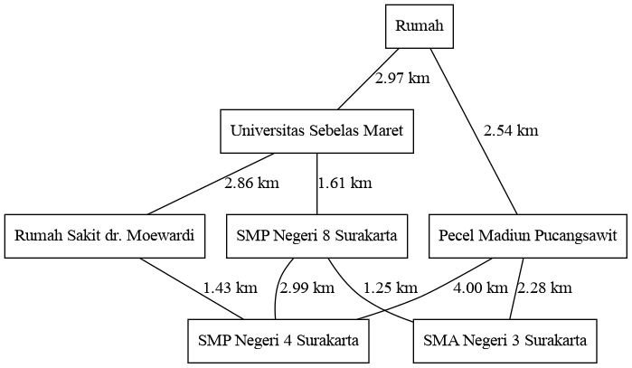

# 1 - Graph

## Konsep Graph

Graph (atau graf) adalah suatu struktur data yang mendefinisikan **relasi** dari suatu data dengan data lain. Suatu graf dapat disusun dari sekumpulan node (simpul) dan edge (penghubung antar node). Dapat dilihat pada contoh di bawah yang mengilustrasikan suatu pertandingan pada suatu group stage UEFA Champions League:



Contoh di atas merupakan contoh graf berjenis **directed graph** karena tiap edge (hasil pertandingan) memiliki **arah** dari suatu node (klub sepak bola) ke node lain. Kemudian berikut adalah contoh yang lain yang merupakan graf Kota Surakarta:



Contoh di atas merupakan contoh graf berjenis **undirected graph** karena tiap edge (jarak antar tempat) **tidak memiliki** arah dari suatu node (nama tempat) ke node lain.

Salah satu istilah dalam graf adalah **tetangga** yang menyatakan daftar node yang terhubung langsung dengan suatu node.

## Implementasi

### Menggunakan Adjacency Matrix

Pada dasarnya adjacency matrix memanfaatkan konsep yang mirip seperti array 2 dimensi (dengan demikian dikatakan matrix) yang mana indeks-indeksnya merepresentasikan node dari suatu graph. Kita tinjau pada graf Champions League:

```c++
enum klub_t {
    REAL_MADRID,
    CHELSEA,
    AC_MILAN,
    VALENCIA,
    JUMLAH_KLUB
};

enum hasil_t {
    MENANG,
    SERI,
    KALAH
};

// ...

// adjacency matrix
hasil_t pertandingan[JUMLAH_KLUB][JUMLAH_KLUB];

// ...

pertandingan[AC_MILAN][VALENCIA] = MENANG;
pertandingan[VALENCIA][AC_MILAN] = KALAH;

pertandingan[REAL_MADRID][CHELSEA] = SERI;
pertandingan[CHELSEA][REAL_MADRID] = SERI;

// dan seterusnya ...

```

Atau pada graf Kota Surakarta:

```c++
enum tempat_t {
    RUMAH,
    UNIVERSITAS_SEBELAS_MARET,
    RUMAH_SAKIT_DR_MOEWARDI,
    SMP_NEGERI_8_SURAKARTA,
    PECEL_MADIUN_PUCANGSAWIT,
    SMP_NEGERI_4_SURAKARTA,
    SMA_NEGERI_3_SURAKARTA,
    JUMLAH_TEMPAT
};

// ...

// adjacency matrix
double jarak[JUMLAH_TEMPAT][JUMLAH_TEMPAT];

// ...

jarak[RUMAH][UNIVERSITAS_SEBELAS_MARET] = 2.97;
jarak[UNIVERSITAS_SEBELAS_MARET][RUMAH] = 2.97;

jarak[UNIVERSITAS_SEBELAS_MARET][RUMAH_SAKIT_DR_MOEWARDI] = 2.86;
jarak[RUMAH_SAKIT_DR_MOEWARDI][UNIVERSITAS_SEBELAS_MARET] = 2.86;

jarak[PECEL_MADIUN_PUCANGSAWIT][SMA_NEGERI_3_SURAKARTA] = 2.28;
jarak[SMA_NEGERI_3_SURAKARTA][PECEL_MADIUN_PUCANGSAWIT] = 2.28;

// beri nilai nol karena merupakan jarak ke dirinya sendiri
jarak[RUMAH][RUMAH] = 0.0;

// beri nilai negatif karena tidak ada jalur langsung dari Rumah ke SMA Negeri 3 Surakarta
jarak[RUMAH][SMA_NEGERI_3_SURAKARTA] = -1.0;
jarak[SMA_NEGERI_3_SURAKARTA][RUMAH] = -1.0;

// dan seterusnya ...

```

### Menggunakan Adjacency List

Adjacency list merupakan salah satu cara lain untuk merepresentasikan suatu graf. Pada dasarnya adjacency list merupakan sebuah array yang berisi semua node yang tiap-tiap elemennya merupakan daftar tetangga beserta edge yang terhubung. Tinjau untuk kasus Champions League:

```c++
struct pertandingan_t {
    klub_t lawan;
    hasil_t hasil;

    pertandingan_t(klub_t _lawan, hasil_t _hasil) {
        lawan = _lawan;
        hasil = _hasil;
    }
};

// ...

// adjacency list
std::list<pertandingan_t> pertandingan[JUMLAH_KLUB];

// ...

pertandingan[AC_MILAN].push_back(pertandingan_t(VALENCIA, MENANG));
pertandingan[VALENCIA].push_back(pertandingan_t(AC_MILAN, KALAH));

pertandingan[REAL_MADRID].push_back(pertandingan_t(CHELSEA, SERI));
pertandingan[CHELSEA].push_back(pertandingan_t(REAL_MADRID, SERI));

// dan seterusnya ...
```

Atau pada graf Kota Surakarta:

```c++
struct jarak_t {
    tempat_t tujuan;
    double jarak;

    jarak_t(tempat_t _tujuan, double _jarak) {
        tujuan = _tujuan;
        jarak = _jarak;
    }
};

// ...

// adjacency list
std::list<jarak_t> jarak[JUMLAH_TEMPAT];

// ...

jarak[RUMAH].push_back(jarak_t(UNIVERSITAS_SEBELAS_MARET, 2.97));
jarak[UNIVERSITAS_SEBELAS_MARET].push_back(jarak_t(RUMAH, 2.97));

jarak[UNIVERSITAS_SEBELAS_MARET].push_back(jarak_t(RUMAH_SAKIT_DR_MOEWARDI, 2.86));
jarak[RUMAH_SAKIT_DR_MOEWARDI].push_back(jarak_t(UNIVERSITAS_SEBELAS_MARET, 2.86));

jarak[PECEL_MADIUN_PUCANGSAWIT].push_back(jarak_t(SMA_NEGERI_3_SURAKARTA, 2.28));
jarak[SMA_NEGERI_3_SURAKARTA].push_back(jarak_t(PECEL_MADIUN_PUCANGSAWIT, 2.28));

// dan seterusnya ...
```

### Menggunakan Edge List

Edge list juga dapat digunakan untuk merepresentasikan suatu graf. Pada dasarnya edge list merupakan sebuah list yang berisi semua definisi edge. Tinjau untuk kasus Champions League:

```c++
struct pertandingan_t {
    klub_t pemain;
    klub_t lawan;
    hasil_t hasil;

    pertandingan_t(klub_t _pemain, klub_t _lawan, hasil_t _hasil) {
        pemain = _pemain;
        lawan = _lawan;
        hasil = _hasil;
    }
};

// edge list
std::list<pertandingan_t> pertandingan;

// ...

pertandingan.push_back(pertandingan_t(AC_MILAN, VALENCIA, MENANG));
pertandingan.push_back(pertandingan_t(VALENCIA, AC_MILAN, KALAH));

pertandingan.push_back(pertandingan_t(REAL_MADRID, CHELSEA, SERI));
pertandingan.push_back(pertandingan_t(CHELSEA, REAL_MADRID, SERI));
```

Atau pada graf Kota Surakarta:

```c++
struct jarak_t {
    tempat_t asal;
    tempat_t tujuan;
    double jarak;

    jarak_t(tempat_t _asal, tempat_t _tujuan, double _jarak) {
        asal = _asal;
        tujuan = _tujuan;
        jarak = _jarak;
    }
};

// edge list
std::list<jarak_t> jarak;

// ...

jarak.push_back(jarak_t(RUMAH, UNIVERSITAS_SEBELAS_MARET, 2.97));
jarak.push_back(jarak_t(UNIVERSITAS_SEBELAS_MARET, RUMAH, 2.97));

jarak.push_back(jarak_t(UNIVERSITAS_SEBELAS_MARET, RUMAH_SAKIT_DR_MOEWARDI, 2.86));
jarak.push_back(jarak_t(RUMAH_SAKIT_DR_MOEWARDI, UNIVERSITAS_SEBELAS_MARET, 2.86));

jarak.push_back(jarak_t(PECEL_MADIUN_PUCANGSAWIT, SMA_NEGERI_3_SURAKARTA, 2.28));
jarak.push_back(jarak_t(SMA_NEGERI_3_SURAKARTA, PECEL_MADIUN_PUCANGSAWIT, 2.28));

```

### Kompleksitas

Berikut adalah tabel perbandingan kompleksitas apabila menggunakan adjacency matrix, adjacency list, atau edge list (dengan keterangan V adalah jumlah vertex/node, E adalah jumlah edge, dan K adalah jumlah tetangga suatu node):

|Tindakan|Adjacency Matrix|Adjacency List|Edge List|
|--|--|--|--|
|Menghubungkan node (menambah edge)|O(1)|O(1)|O(1)|
|Memisahkan node (menghapus edge)|O(1)|O(K)|O(E)|
|Cek keterhubungan dua node|O(1)|O(K)|O(E)|
|Iterasi seluruh tetangga|O(V)|O(K)|O(E)|
|Kebutuhan memori|O(V^2)|O(E)|O(E)|

## Selengkapnya

- [Graf (e-Book Pemrograman Kompetitif Dasar)](https://ksn.toki.id/data/pemrograman-kompetitif-dasar.pdf)
